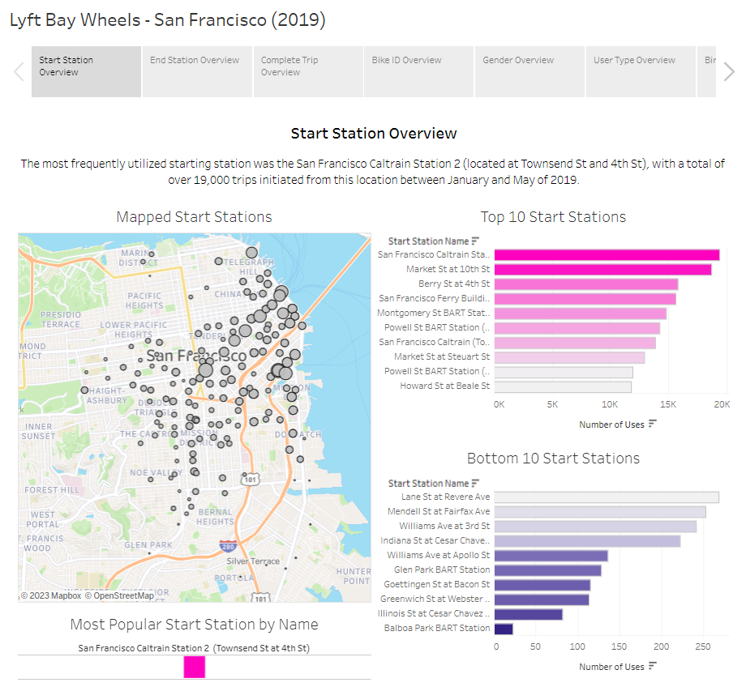

# Bay Wheels - San Francisco (2019)

## Table of Contents:
01. [About The Project](#about) 
02. [Technologies](#tech)
03. [Approach](#approach)
04. [Extract, Transform, Load](#etl)
05. [The Dashboard](#dashboard)
06. [Going Forward](#forward)
07. [Data Source](#source)

## About The Project:
Bay Wheels is a bike-sharing program, which is supported by Lyft, a leading rideshare provider, in California. With the aim of providing alternative modes of transportation for the general public, particularly in densely populated areas, Bay Wheels serves as a practical solution for those who lack the means of personal transportation. Additionally, the program addresses the needs of local residents who reside in close proximity to their frequent destinations.

This project was initiated with an interest in analyzing the usage of Bay Wheels prior to the outbreak of the pandemic. Although the program has undergone changes in terms of station locations, with some being discontinued permanently, this analysis can offer insights that could assist city officials in enhancing the efficiency and visibility of the program.

## Technologies:
- Jupyter Notebook
- Python
- Pandas
- PostgreSQL
- Tableau

## Approach:
01. Identify data source
02. Collect and clean Bay Wheels data
03. Load data into PostgreSQL
04. Research and add cities and state into the data
05. Research and add latitude and longitude coordinates for start and end stations into the data
06. Confirm usable data
07. Visualize dashboard in Tableau

## Extract, Transform, Load:
The data was provided in 5 separate CSV's so I started by combining them all into 1 CSV.

I performed an initial examination of the dataset to determine its [dimensions](https://github.com/DConnellyII/lyft_bay_wheels/blob/main/images/etl_images/etl_02.png), including the number of rows and columns. Subsequently, I reviewed the [column headers](https://github.com/DConnellyII/lyft_bay_wheels/blob/main/images/etl_images/etl_03.png) to ensure the accuracy of the data, making any necessary [modifications](https://github.com/DConnellyII/lyft_bay_wheels/blob/main/images/etl_images/etl_04.png) to the column data as required.

In the next step of my analysis, I conducted a thorough assessment of the presence of missing or [null values](https://github.com/DConnellyII/lyft_bay_wheels/blob/main/images/etl_images/etl_05.png) in the dataset. Upon review, I identified 745 records with missing start and end stations, which could be attributed to bikes that were used but not properly docked, resulting in the absence of information. Additionally, I encountered 49,376 and 49,370 missing values for birth year and gender, respectively. Given that these missing values constituted approximately 5% of the data, I elected to [remove](https://github.com/DConnellyII/lyft_bay_wheels/blob/main/images/etl_images/etl_06.png) them from the analysis to maintain the integrity of the data and avoid any potential biases in the results.

Subsequently, I conducted a verification of the [data types](https://github.com/DConnellyII/lyft_bay_wheels/blob/main/images/etl_images/etl_07.png) and made any necessary conversions to ensure consistency and accuracy. Upon completion of this step, I confirmed the validity of the data and exported the consolidated information into a single [CSV](https://github.com/DConnellyII/lyft_bay_wheels/blob/main/images/etl_images/etl_08.png) file for further analysis.

After the data was exported into a single CSV file, I performed data manipulations to enhance the clarity and organization of the information. This involved rearranging the columns in a [logical order and creating new columns](txt/bay_wheels_summary_format.txt) to include city, state, latitude and longitude information for both the start and end stations. This additional information was included in order to facilitate the visualization of the data on a static map using Tableau.

Initially, I attempted to gather location information for each station in the Bay Wheels program through manual research on the [map](https://account.baywheels.com/map) provided. This involved working within a cleaned version of the CSV file in Excel and adding the relevant information. However, I soon realized that this approach would be extremely time-consuming due to the volume of information required, and there were several technical difficulties encountered while accessing the information on the Lyft website. Additionally, there was a potential for [inaccuracies](https://github.com/DConnellyII/lyft_bay_wheels/blob/main/images/sql_images/sql_01.png) to occur due to human error, so I decided to explore alternative methods for inputing the information.

To address the limitations of the initial approach, I decided to adopt an alternative strategy. I utilized Google Maps to obtain the accurate [city information](images/sql_images/sql_02.png) and latitude and longitude coordinates for the start and end stations. The updated information was then incorporated into the dataset through the use of [SQL database management](images/sql_images/sql_03.png).

In order to ensure the accuracy and reliability of the analysis, I conducted a thorough examination of the member birth year and gender data. During this process, I identified inaccuracies in the birth year information and decided to remove this data to prevent potential bias in the analysis. To further refine the focus of the analysis, I limited the birth year data to the range of [1939 to 2001](images/sql_images/sql_05.png), ensuring that all members included in the analysis were between the ages of 18 and 80 during the period of analysis.

Initially, the analysis encompassed data from multiple cities, including Berkeley, Emeryville, Oakland, San Francisco, and San Jose. However, to facilitate a more focused examination, I narrowed the scope of the analysis to concentrate solely on [San Francisco](images/lyft_images/san_francisco_bay_wheels.png), as it accounted for the majority of trips taken through the platform. The data from the other cities was [removed](images/sql_images/sql_04.png), and the remaining data was exported to a final CSV file for import into Tableau.

## The Dashboard:

[Lyft Bay Wheels - San Francisco (2019)](https://public.tableau.com/app/profile/dconnellyii/viz/san_francisco_lyft_bay_wheels_2019/SanFranciscoBayWheels2019)

## Going Forward:
- Do an analysis on the East Bay area (Berkeley, Emeryville, Oakland) and San Jose.
- Look into trying to find a way to get daily and/or time data to see what days and time of day the bikes were used.
- Look into finding data for the second half of the year and create a yearly dataset for analysis.
- Find more recent data and see how any of the trip data has changed after the pandemic.

## Data Source:
This dataset comprises anonymized trip records of the Lyft bike-sharing system, Bay Wheels, in the Bay Area of California, covering the period from January to May 2019. The data was derived from publicly available information on the [Lyft bike-sharing platform](https://www.lyft.com/bikes/bay-wheels). I used all 5 of the CSV's for my analysis.

- [Kaggle: Bay Area Bike Sharing Trips](https://www.kaggle.com/datasets/jolasa/bay-area-bike-sharing-trips)
