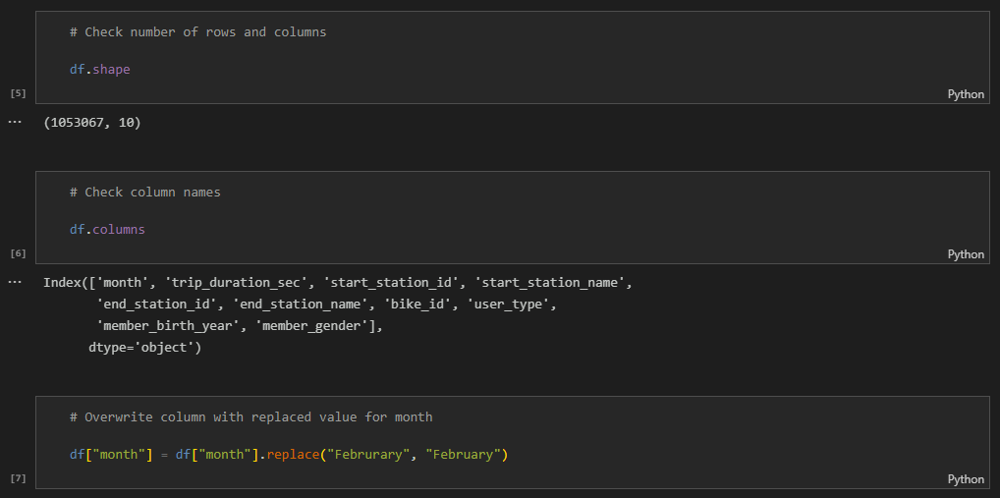

# Bay Wheels - San Francisco (2019)

## Table of Contents: :house_with_garden:
01. [About The Project](#about)
02. [Data Source](#source)
03. [Technologies](#tech)
04. [Approach](#approach)
05. [Extract, Transform, Load](#etl)
06. [Exploratory Data Analysis](#eda)
07. [The Dashboard](#dashboard)
08. [Going Forward](#forward)
09. [Contributor](#team)

## About The Project: :thinking:
Bay Wheels is a bike-sharing initiative backed by the rideshare provider Lyft in California. Many highly populated areas have turned to alternate sources of transportation to help the general public who may not have the means of acquiring their own. It could also be a viable solution to local residents who don't live far away from destinations they frequent. I wanted to work with this data because I was interested in seeing how Bay Wheels was being utilized the year before the pandemic. Although there have already been changes to several of the bike station locations as of 2023, some being permanently closed, this type of analysis could help city officials looking to publicize and improve the program.

## Data Source: :books:
This is an anonymized trips dataset of Lyft bike sharing system (Bay Wheels), in the Bay Area of California from January 2019 to May 2019. This data was created with information obtained from the [Lyft bike sharing site](https://www.lyft.com/bikes/bay-wheels). I used all 5 of the CSV's for my analysis.

- [Kaggle: Bay Area Bike Sharing Trips](https://www.kaggle.com/datasets/jolasa/bay-area-bike-sharing-trips)

## Technologies: :building_construction::hammer_and_wrench:
- Jupyter Notebook
- Python
- Pandas
- PostgreSQL
- Tableau

## Approach: :computer:
01. Identify data source
02. Collect and clean Bay Wheels data
03. Load data into PostgreSQL
04. Research and add cities and state into the data
05. Research and add latitude and longitude coordinates for start and end stations into the data
06. Visualize dashboard in Tableau

## Extract, Transform, Load: :magic_wand:
The data was provided in 5 separate CSV's so I started by [combining them all into 1 CSV](https://github.com/DConnellyII/lyft_bay_wheels/blob/main/images/etl_images/etl_01.png).

I then checked the shape of the original data to see how many rows and columns I would be working with. From there, I checked the name of the columns because I needed to rename some data for accuracy.

I also [checked for any null values in the dataset](https://github.com/DConnellyII/lyft_bay_wheels/blob/main/images/etl_images/etl_03.png) to determine if it was worth having them or if they could be dropped to improve the analysis. There were 745 start and end stations that were missing. I assume these may be bikes that were used but never docked so it didn't allow for any information to be recorded. There were also 49,376 birth years and 49,370 genders that were not recorded. This could be that the users didn't want to record any personal information of themselves. Being that it was around 5% of the data, I decided to drop them.

Then, I [verified and changed a few datatypes](https://github.com/DConnellyII/lyft_bay_wheels/blob/main/images/etl_images/etl_04.png) and once the data checked out, I exported the merged data into a single CSV.

From there, I started researching the [Bay Wheels map](https://account.baywheels.com/map) to try and get location information for each of the stations. I wanted to add the city names, the state and both latitudes and longitudes for each start and end station.

Initially, I was working within the CSV file in Excel adding the latitudes and longitudes, but realized that it would be time consuming because of the amount of information I needed to include and the Lyft website had several hang ups while searching. It also could present the opportunity for inaccuracies (which happened) if I continued this way.

I decided to upload my data into PostgreSQL to add my data into my dataset.  The more I worked with my queries, the more advanced they became to save time and increase accuracy. 

Originally, I was working with all of the data from each city (Berkeley, Emeryville, Oakland, San Francisco, San Jose).